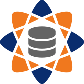
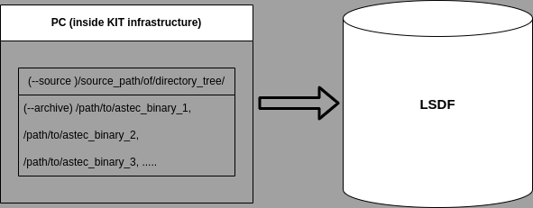

<div align="center">
  <table role="presentation" cellspacing="24" cellpadding="0">
    <tr>
      <td align="center" valign="middle">
        <table role="presentation" border="1" cellspacing="0" cellpadding="12">
          <tr>
            <td align="center" valign="middle">
              <a href="https://assas-horizon-euratom.eu/">
                
                <br />
                <sub><em>ASSAS Project</em></sub>
              </a>
            </td>
          </tr>
        </table>
      </td>
      <td align="center" valign="middle">
        <table role="presentation" border="1" cellspacing="0" cellpadding="12">
          <tr>
            <td align="center" valign="middle">
              <a href="http://www.kit.edu/english/index.php">
                
                <br />
                <sub><em>Karlsruhe Institute of Technology (KIT)</em></sub>
              </a>
            </td>
          </tr>
        </table>
      </td>
    </tr>
  </table>
</div>

----

# ASSAS Data Hub

The ASSAS Data Hub is a web application to store and visualize ASTEC simulation data on the Large Scale Data Facility at KIT. Its database contains the ASTEC archive in binary raw format and offers a conversion in other data formats. At the moment only a conversion in hdf5 data format is supported.

- [Prequisites](#prequisites)
- [Installation](#installation)
- [Upload of ASTEC Data](#upload-of-astec-data)
- [Profile](#profile)
- [Database View](#database-view)
- [Tools](#tools)
- [RESTful API](#restful-api)
- [Curator Tools](#curator-tools)

## Prequisites

The ASSAS Data Hub is a flask web application, which requires the following additional software packages:

* [MongoDB Version 7.0.6](https://www.mongodb.com/docs/manual/release-notes/7.0/)
* [Python3.11 virtual environment](https://docs.python.org/3/library/venv.html)
* [ASTEC V3.1.1/V3.1.2 installation](https://gforge.irsn.fr/?lang=en#/project/astec/frs/7574/details)
* [Cron 1.5.2](https://wiki.ubuntuusers.de/Cron/)

## Installation

### Start application

Entrypoint of the application is wsgi.py (Python Web Server Gateway Interface) and can be started with:

```console
$ python wsgi.py
```

The application starts as a custom flask app. Available under 
[https://assas.scc.kit.edu/assas_app/home](https://assas.scc.kit.edu/assas_app/home)
on a virtual machine inside as the ASSAS Server inside the KIT infrastructure.

### NoSQL Database

Local db runs on ``CONNECTIONSTRING = r'mongodb://localhost:27017/'``.

MongoDB typically stores its data under `/var/lib/mongodb` and is configured via `/etc/mongod.conf` (paths can differ depending on your system/package).

Restart MongoDB:

```console
# systemd-based systems (recommended)
$ sudo systemctl restart mongod
$ sudo systemctl status mongod --no-pager

# legacy SysV style (if systemctl is not available)
$ sudo service mongod restart
```

The application supports **two MongoDB deployment options**:

1. **MongoDB Atlas (recommended / production)** — managed cluster in MongoDB Atlas
2. **Local MongoDB (optional / development)** — local daemon on the same machine

The connection is configured via the application connection string.

**Local example:**

```
CONNECTIONSTRING = r"mongodb://localhost:27017/"
```

**Atlas example (template):**

```
CONNECTIONSTRING = r"mongodb+srv://<USER>:<PASSWORD>@<CLUSTER>/<DB_NAME>?retryWrites=true&w=majority"
```

#### Backups

- **Atlas:** Backups are typically handled by Atlas (depending on the configured Atlas backup settings for the project/cluster).
- **Local MongoDB:** Backups are created automatically by an **internal backup tool** running as a **cron job** on the server. The cron job executes `assas_backup_job.py`, which creates MongoDB logical backups (e.g., via `mongodump`) and stores them on the **LSDF** according to the configured retention policy.


### Mount LSDF share

The following command mounts the LSDF on the server system for the user ``USER``:

```console
$ sudo mount -t cifs -o vers=2.0,username='USER',uid=$(id -u),gid=$(id -g) //os.lsdf.kit.edu/kit/scc/projects/ASSAS /mnt/ASSAS
```

### Cron Jobs

The ASSAS Data Hub uses **three server-side cron jobs**:

1. **Process job** — The script `assasdb/cron_jobs/assas_process_job.py` picks up newly uploaded datasets and starts the conversion pipeline.
2. **Validation job** —  The script `assasdb/cron_jobs/assas_validation_job.py` validates conversion outputs and finalizes dataset status/metadata.
3. **Backup job** — The script `assasdb/cron_jobs/assas_backup_job.py` creates regular MongoDB backups and stores them on the LSDF.

Cron jobs are typically configured via `crontab -e` (user crontab) or under `/etc/cron.d/*` (system-wide).

**1. Process Job**

**Purpose:** 

Checks if there are new uploads, add them them to the internal database in status `UPLOADED`.

**Typical steps:**
- query DB for new uploads
- set status to `UPLOADED`
- run conversion (e.g., ASTEC archive → HDF5) and post-processing
- write logs and intermediate results for the next step (validation)

**Outcome:** dataset remains `UPLOADED` until the validation job confirms the results.

**2. Validation Job**

**Purpose:** Final quality gate after processing. Validates produced artifacts and extracted metadata, then sets the final status.

**Typical checks:**
- expected output files exist (e.g., generated HDF5)
- files are readable and non-empty; basic integrity checks
- required metadata fields are present
- conversion/processing logs contain no fatal errors

**Outcome:**
- `VALID` if checks pass
- `INVALID` if checks fail (with errors available in logs / server-side diagnostics)

**3. Backup Job (LSDF)**

**Purpose:** Regular database backups for **local MongoDB deployments**.

- Executed as a cron job running `assas_backup_job.py`
- Creates MongoDB logical backups (e.g., via `mongodump`)
- Stores backups on the **LSDF**
- Applies the configured retention policy (prunes old backups)

**Inspecting the configured jobs**

```console
$ crontab -l
$ sudo ls -la /etc/cron.d
$ sudo cat /etc/crontab
```

Search for the backup script specifically:

```console
$ sudo grep -R "assas_backup_job.py" -n /etc/cron.d /etc/crontab 2>/dev/null || true
$ crontab -l | grep -n "assas_backup_job.py" || true
```

### Reverse-proxy configuration

In production, the app is typically run as a **systemd service** (Gunicorn) and exposed via **nginx** (reverse proxy).

**1. Install nginx (and enable it)**

```console
$ sudo apt-get update
$ sudo apt-get install -y nginx
$ sudo systemctl enable --now nginx
$ sudo systemctl status nginx --no-pager
```

**2. Create a systemd service for the application (Gunicorn)**

This runs the Flask app via the WSGI entrypoint (`wsgi:app`) on `127.0.0.1:8000`.

Create `/etc/systemd/system/assas-data-hub.service`:

````ini
# filepath: /etc/systemd/system/assas-data-hub.service
[Unit]
Description=ASSAS Data Hub (Gunicorn)
After=network.target

[Service]
Type=simple
User=www-data
Group=www-data
WorkingDirectory=/root/assas-data-hub-dev

# Use your venv python/gunicorn paths
Environment="PATH=/root/assas-data-hub-dev/.venv/bin"
ExecStart=/root/assas-data-hub-dev/.venv/bin/gunicorn \
  --bind 127.0.0.1:8000 \
  --workers 3 \
  --timeout 300 \
  wsgi:app

Restart=always
RestartSec=3

[Install]
WantedBy=multi-user.target
````

## Upload of ASTEC Data

Uploads are performed with the helper script `tools/assas_data_uploader.py`.

### What the uploader actually does (LSDF + rsync)

The uploader is designed to **transfer large ASTEC archives efficiently** by writing **directly to the LSDF** via **SSH + `rsync`**:

- **Data path:** your machine → `rsync` over SSH → **LSDF storage**
- **Control path:** the uploader also **registers/updates metadata** so the dataset appears in the ASSAS Data Hub UI and can be processed by server-side cron jobs.

This approach avoids pushing large files through the web application and makes interrupted uploads resumable (rsync only transfers missing/changed parts).

### Typical workflow

1. Prepare your local ASTEC project directory and the archive file(s) you want to upload.
2. Ensure you have:
   - LSDF access (KIT/guest account)
   - password-less SSH to the LSDF login node (see below)
   - `rsync` installed locally
3. Run the uploader (examples are in the **[Tools](#tools)** section).
4. After upload, the dataset will show up in the Data Hub and will move through statuses like:
   `UPLOADED → CONVERTING → VALID/INVALID` (handled by server-side cron jobs).

### Notes / troubleshooting

- If uploads are slow or fail mid-way, re-running the uploader typically resumes because `rsync` can continue partial transfers.
- The uploader depends on a working SSH setup; test first:
  ```console
  $ ssh <USERNAME>@os-login.lsdf.kit.edu
  ```
- Make sure `rsync` is installed:
  ```console
  $ rsync --version
  ```

The upload of ASTEC data is supported through an upload application under ``tools/assas_data_uploader.py``.

See the **[Tools](#tools)** section for the uploader (`tools/assas_data_uploader.py`) and detailed upload instructions.

### Required Access and Configuration

The use of the upload application requires the following:

1. Request of a Partner- and Guest-KIT Account ([https://www.scc.kit.edu/en/services/gup.php](https://www.scc.kit.edu/en/services/gup.php))
2. Access to the LSDF with this Account ([https://www.lsdf.kit.edu/](https://www.lsdf.kit.edu/))
3. Configure a password-less ssh login to the login server of the LSDF ([https://www.lsdf.kit.edu/docs/ssh/#using-ssh-on-linux-or-mac-os](https://www.lsdf.kit.edu/docs/ssh/#using-ssh-on-linux-or-mac-os)). The password-less configuration is mandatory to perform the upload. The application will not start without a password-less configuration.
   Create a new ssh key pair with the following command:
   ```console
   $ ssh-keygen
   ```
   This command creates a ssh key pair. For further usage it is recommended to just type enter two times and use the standard key name and no passphrase. The generated key pair is then placed at the standard location ``~/.ssh/id_rsa.pub`` and ``~/.ssh/id_rsa``. The generated key pair has to be used for the next commands. Please check that the path to the keys is correct. Transfer this public key to the login server of the LSDF with the following command:
   ```console
   $ ssh-copy-id -i ~/.ssh/id_rsa.pub <USERNAME>@os-login.lsdf.kit.edu
   ```
   Add the private key as idenitiy on the local machine in executing the following command:
   ```console
   $ ssh-add ~/.ssh/id_rsa
   ```
   Note: Depending on your system it might be the case that your authentication agent is not started. You will get a message like ``Could not open a connection to your authentication agent.``. In this case you can restart the ssh-agent with the following command:
   ```console
   $ eval `ssh-agent -s`
   ```
   Depending on your operating system, you can also start your authentication agent with the following command:
   ```console
   $ ssh-agent /bin/sh
   ```
   If the authentication agent is started, the command ``ssh-add ~/.ssh/id_rsa`` can be executed again.
   Please test the password-less configuration before continuing with the next steps by executing the command:
   ```console
   $ ssh <USERNAME>@os-login.lsdf.kit.edu
   ```
   This command should open the terminal to the LSDF without asking for a password.
4. Installation of ``Python3.10+`` and ``rsync`` on the local machine ([https://www.python.org/downloads/](https://www.python.org/downloads/) and [https://wiki.ubuntuusers.de/rsync/](https://wiki.ubuntuusers.de/rsync/))
5. Definition of the upload parameters of the ASTEC archive according to the commandline interface described in the next section
6. Update schematic:

<figure>
  <a href="./flask_app/dash_app/assets/assas_data_upload.png">
    
  </a>
  <figcaption align="center">
    <em>Uploader tool (schematic): configure source, archives, and metadata before transfer.</em><br />
  </figcaption>
</figure>

7. See the **[Tools](#tools)** section for the uploader (`tools/assas_data_uploader.py`) and detailed upload instructions.

## Database View

The database can be inspected under **Database page:** https://assas.scc.kit.edu/assas_app/database/.

The database view displays a list with all available datasets and provides the following parameters:

* ``Index``: Unique index of dataset
* ``Binary Size``: Size of ASTEC binary archive
* ``HDF5 Size``: Size of the HDF5 file after conversion
* ``Date``: Upload time
* ``User``: User which has uploaded the dataset
* ``Status``: Status of the uploaded dataset
* ``Name``: Given name of the uploaded dataset

By clicking on the column cell ``File`` the user can download the HDF5 file.

By clicking on the parameter ``Name`` the user is taken to a detailed view with the following meta information about the dataset.

### Status

A database entry can have the following states:

* ``UPLOADED``: Direct after the upload the database entry is in this state.
* ``CONVERTING``: After the upload the conversion and post-processing will be started automatically.
* ``VALID``: If the conversion and the post-processing were successful the database entry is in a valid state.
* ``INVALID``: If the conversion and the post-processing were unsuccessful the database entry is in an invalid state.

### Data

The following meta information is extracted during the upload and conversion process:

* Variables: List of extracted variables
* Channels: Number of extracted channels
* Meshes: Number of extracted meshes
* Samples: Number of extracted samples

## Profile

Some parts of the ASSAS Data Hub may require authentication (login).

* **Database page:** https://assas.scc.kit.edu/assas_app/database
* **Login (Basic auth endpoint used by tools):** https://assas.scc.kit.edu/auth/basic/login. If your deployment provides a GUI login page, use that URL instead.
* **Contact:** Visit our https://assas.scc.kit.edu/assas_app/home for more information.
* **Email:** Email contact if access is needed contact [jonas.dresssner@kit.edu](mailto:jonas.dresssner@kit.edu).

### Authentication methods

Depending on the deployment, the ASSAS Data Hub can support multiple authentication methods.

**1. Basic authentication (username/password)**

**What it is:** A simple login using a username + password, primarily intended for **API clients and CLI tools**.

**How it works (high-level):**
- The client sends credentials to the **Basic login endpoint** (`/auth/basic/login`).
- On success, the server typically returns an authenticated **session** (commonly via cookies).
- Subsequent API calls reuse that session.

**When to use it:**
- Command-line tools like the uploader/downloader or other automated clients.
- Local/dev setups where SSO is not configured.

**Notes:**
- The exact request/response format can differ between deployments (session cookie vs token-style responses).
- Prefer using the provided tools (they implement the expected login flow for this app).

**2 .Helmholtz authentication (Helmholtz AAI / SSO)**

**What it is:** Single Sign-On (SSO) via the Helmholtz Authentication and Authorization Infrastructure (AAI)
(typically OpenID Connect/OAuth2-based), using your institutional identity (e.g., “Helmholtz ID”).

**How it works (high-level):**
- You open the Data Hub in a browser.
- You are redirected to the Helmholtz login page to authenticate.
- After login, you are redirected back to the Data Hub with an SSO session established.

**When to use it:**
- Interactive browser use in institutional deployments.
- Deployments where Basic auth is disabled or restricted.

**Notes:**
- SSO endpoints/URLs are deployment-specific (reverse proxy / identity provider configuration).
- CLI tools usually do **not** use the interactive SSO flow unless a dedicated non-interactive token flow is provided by the deployment.

## Tools

This repository provides command-line helper scripts in `tools/` for uploading and downloading datasets.

### Uploader (`tools/assas_data_uploader.py`)

Upload ASTEC project archives to the LSDF and register them in the ASSAS Data Hub database.

**Typical workflow**

1. Collect an ASTEC project directory (source) and one or more archive paths.
2. Run the uploader to transfer the data to LSDF and create the corresponding dataset entry.
3. Monitor conversion status later in the **Database view** (e.g., `UPLOADED → CONVERTING → VALID/INVALID`).

**Common CLI parameters (see `--help` for the full list)**

- `--user` / `-u` — KIT/LSDF user (must have LSDF access)
- `--source` / `-s` — Absolute path to the ASTEC project directory to upload
- `--name` / `-n` — Dataset name as shown in the database
- `--description` / `-d` — Dataset description / notes
- `--archives` / `-a` — One or more archive paths (comma-separated)

The commandline interface of the upload application has the following optional parameter:

- `--uuid` / `-i` — Upload identifier of an upload process which was already started
- `--debug` / `-l` — Enable debug logging of the application

The parameter --uuid can be used to resume an interrupted or failed upload. One must determine the upload uuid from the standard output of the upload application or from the log file.

**Examples:**

For only one archive path (`/abs/path/a1`):

```console
$ python tools/assas_data_uploader.py -u my_user -s /abs/path/to/project -n "My dataset" -d "Short description" -a /abs/path/a1
```

It is also possible to upload severval archive paths (in a list `/abs/path/a1,/abs/path/a2,..`):

```console
$ python tools/assas_data_uploader.py -u my_user -s /abs/path/to/project -n "My dataset" -d "Short description" -a /abs/path/a1,/abs/path/a2
```

**Logging**

The application produces a log file for each execution. The name of the logfile starts with the upload uuid.

### Downloader (`tools/assas_data_downloader.py`) — recommended for automated downloads

Authenticate against the REST API and download datasets to `./downloads/`. A manifest is written so repeated runs can resume/skip already downloaded datasets.

**What it does:**
- Prompts for **API base URL**, **username**, and **password**
- Authenticates (session-based), lists datasets (typically `status=Valid`), then downloads files
- Writes:
  - downloads into `downloads/`
  - manifest into `downloads/manifest.json`
  - log file `assas_data_downloader.log`

**CLI options:**
- `--loglevel` — `DEBUG|INFO|WARNING|ERROR|CRITICAL` (default: `INFO`)
- `--max-downloads` — max datasets to download in this run (`0` = no limit)
- `--skip-existing` — skip datasets already present in the manifest or as an existing file
- `--manifest` — path to manifest file (default: `downloads/manifest.json`)
- `--limit` — max number of datasets requested from the API (default: `1000`)
- `--offset` — paging offset when listing datasets (default: `0`)

**Examples:**
```console
# Download everything (interactive prompts for URL/user/password)
$ python tools/assas_data_downloader.py

# Skip already downloaded items and only fetch the next 10
$ python tools/assas_data_downloader.py --skip-existing --max-downloads 10

# Debug logging and paging through the list
$ python tools/assas_data_downloader.py --loglevel DEBUG --limit 200 --offset 200
```

Show all available options:
```console
$ python tools/assas_data_uploader.py --help
$ python tools/assas_data_downloader.py --help
```

## RESTful API

The ASSAS Data Hub provides a RESTful API to query training data in an automated way.

### v1 RESTful API Documentation

All endpoints are available under the `/assas_app/` path. All endpoints return JSON.

**Base URLs (clickable):**
- **Home Page:** https://assas.scc.kit.edu/assas_app/home/
- **API base path:** https://assas.scc.kit.edu/assas_app/

#### Authentication

Some endpoints require authentication. Use your username and password to obtain a session or token as described in the login section of the web interface.

> **Note (browser / clickable links):** You can also open the endpoints directly in your browser. The links shown below are provided as clickable hyperlinks for convenience.  

> **Note (authentication):** Some endpoints require authentication. “Bare” `curl` examples (without cookies/headers) may fail with `401/403`. If a bare request appears to work in an interactive shell, credentials may already be present in that environment. For automated downloads, prefer the downloader script (it logs in and reuses the authenticated session).

#### Downloader script (recommended)

For automated downloads (e.g., in pipelines/CI), use the downloader script instead of manually calling the API with `curl`.

- **Script:** `tools/assas_data_downloader.py`
- **What it does:**
  1. Prompts for **API base URL** (default: `https://assas.scc.kit.edu`)
  2. Prompts for **username** and **password** (hidden input)
  3. Authenticates via `POST /auth/basic/login` (session cookies)
  4. Lists datasets via `GET /assas_app/datasets?status=Valid`
  5. Downloads each dataset via `GET /assas_app/files/download/<uuid>` into `./downloads/`
  6. Writes a manifest so repeated runs can skip already-downloaded files
- **Outputs:**
  - Downloads are stored in: `downloads/`
  - Manifest file (default): `downloads/manifest.json`
  - Log file: `assas_data_downloader.log` (also prints to stdout)

**CLI options:**
- `--loglevel` (default: `INFO`) — `DEBUG|INFO|WARNING|ERROR|CRITICAL`
- `--max-downloads` (default: `0`) — max datasets to download in this run (`0` = no limit)
- `--skip-existing` — skip datasets already present in the manifest or as an existing file
- `--manifest` (default: `downloads/manifest.json`) — path to the manifest file
- `--limit` (default: `1000`) — max number of datasets requested from the API
- `--offset` (default: `0`) — offset for paging through the dataset list

Show help:
```console
$ python tools/assas_data_downloader.py --help
```

#### Endpoints

##### List all datasets

```
GET /assas_app/datasets
```

**Browser (clickable):**
- https://assas.scc.kit.edu/assas_app/datasets
- https://assas.scc.kit.edu/assas_app/datasets?status=valid

**Query parameters:**
- `status` (optional): Filter datasets by status (e.g., `valid`)
- `limit` (optional): Limit the number of results

**Example:**
```bash
curl "https://assas.scc.kit.edu/assas_app/datasets?status=valid"
```

##### Get dataset metadata

```
GET /assas_app/datasets/<uuid>
```

**Example:**
```bash
curl https://assas.scc.kit.edu/assas_app/datasets/d0dd92a3-504a-4623-b2c1-4b42cad516a9
```

##### Get variable data from a dataset

```
GET /assas_app/datasets/<uuid>/data/<variable_name>
```

**Query parameters:**
- `include_stats` (optional): If `true`, include statistics about the variable

**Example:**
```bash
curl "https://assas.scc.kit.edu/assas_app/datasets/d0dd92a3-504a-4623-b2c1-4b42cad516a9/data/vessel_rupture?include_stats=true"
```

##### Download dataset archive

```
GET /assas_app/files/archive/<uuid>
```

**Example:**
```bash
curl -O https://assas.scc.kit.edu/assas_app/files/archive/d0dd92a3-504a-4623-b2c1-4b42cad516a9
```

#### Response Format

All API responses are JSON objects with at least the following fields:
- `success`: `true` or `false`
- `data`: The requested data (if successful)
- `message` or `error`: Error message (if not successful)

#### Example Response

```json
{
  "success": true,
  "data": {
    "uuid": "d0dd92a3-504a-4623-b2c1-4b42cad516a9",
    "name": "Test Dataset",
    "status": "valid",
    "variables": ["vessel_rupture", "pressure", "temperature"]
  }
}
```

#### Error Handling

If a request fails, the API returns a JSON object with `success: false` and an `error` or `message` field describing the problem.

---

## Curator Tools

### Update dataset attributes (CLI)

A small command-line tool is provided to update dataset metadata (title, name, description) via the REST API:

- Script: `tools/assas_update_dataset_attributes.py`
- Auth: Uses the same cookie-session authentication as `tools/assas_data_downloader.py` (`POST /auth/basic/login`)
- Requires curator/admin permissions.

#### Usage

```bash
cd /root/assas-data-hub-dev

# Optional: configure via environment variables
export ASSAS_USERNAME="your_user"
export ASSAS_PASSWORD="your_password"
export ASSAS_BASE_PATH="/assas_app"   # deployment prefix

python tools/assas_update_dataset_attributes.py \
  --base-url "https://assas.scc.kit.edu" \
  --dataset-id "d0dd92a3-504a-4623-b2c1-4b42cad516a9" \
  --title "New title" \
  --name "new_technical_name" \
  --description "New description"
```

If your environment uses a self-signed certificate, you can disable SSL verification:

```bash
python tools/assas_update_dataset_attributes.py \
  --base-url "https://assas.scc.kit.edu" \
  --dataset-id "d0dd92a3-504a-4623-b2c1-4b42cad516a9" \
  --title "New title" \
  --name "new_technical_name" \
  --description "New description" \
  --no-verify-ssl
```

#### Return codes

The tool prints the HTTP response and exits with a code suitable for scripting:

- `0` success (2xx)
- `3` authentication/permission error (401/403)
- `4` endpoint not found (404)
- `5` conflict (409), e.g. duplicate `meta_title` or `meta_name`
- `1` other error

## Editing dataset metadata in the GUI

Users with the appropriate role (**curator** or **admin**) can edit dataset metadata directly in the web interface.

1. Open the **Database View**.
2. Select a dataset and open the **dataset details** page (click on the dataset name).
3. Click **Edit** (or the metadata edit action) and update:
   - **Title** (`meta_title`)
   - **Name** (`meta_name`)
   - **Description** (`meta_description`)
4. Save the changes.

### Manual (step-by-step) workflow

1. **Find the dataset**
   - Go to **Database view**
   - Use the search/filter box to narrow down by dataset **name**, **status**, or **user**
   - Click the dataset **Name** to open the details page

2. **Edit metadata**
   - On the details page, locate the **Metadata** section
   - Click **Edit** to enable the input fields
   - Enter the new values for title/name/description

3. **Validate and save**
   - Ensure **Name** (`meta_name`) and **Title** (`meta_title`) are not already used by another dataset
   - Click **Save**
   - Wait for the confirmation message (the update is written to MongoDB and the underlying NetCDF4 file)

4. **Verify the change**
   - Return to the **Database view**
   - Refresh/reload the page if needed
   - Confirm the updated **Name** and **Description** are visible

Notes:
- The GUI uses the REST endpoint `POST /datasets/<uuid>/attributes`.
- `meta_title` and `meta_name` must be **unique** across datasets (the server returns `409 Conflict` if duplicates are detected).
- Updating metadata changes both the MongoDB entry and the underlying NetCDF4 file attributes (to keep them in sync).

<div align="center">
  <a href="http://www.kit.edu/english/index.php">
    
  </a>
  <div style="font-size: 0.95em; color: #57606a;">
    <em>Karlsruhe Institute of Technology (KIT)</em>
  </div>
</div>